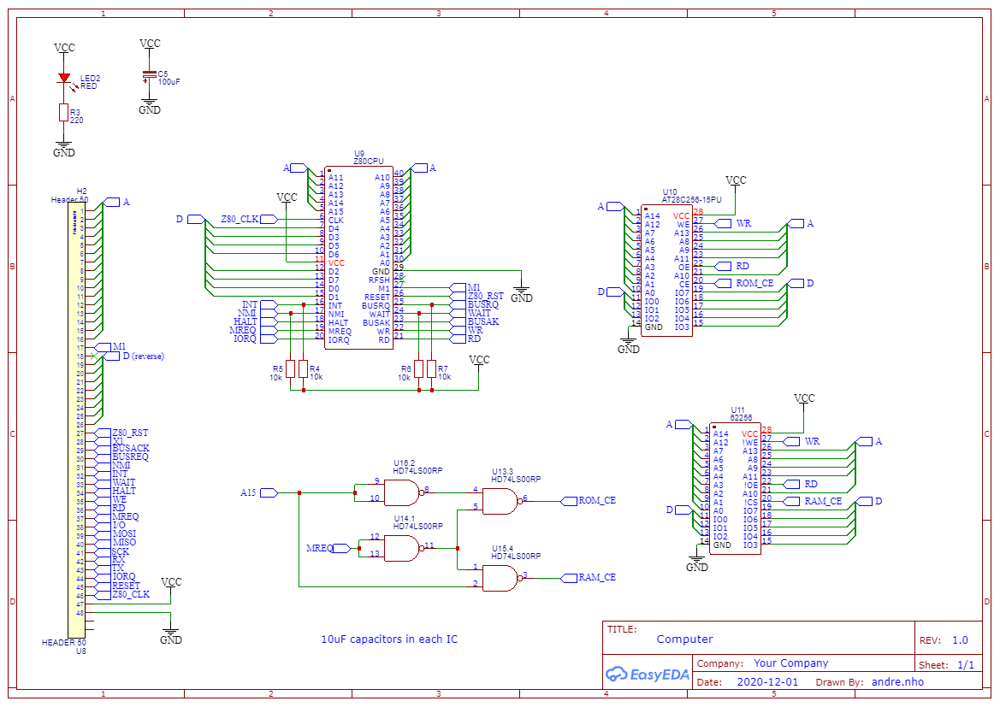
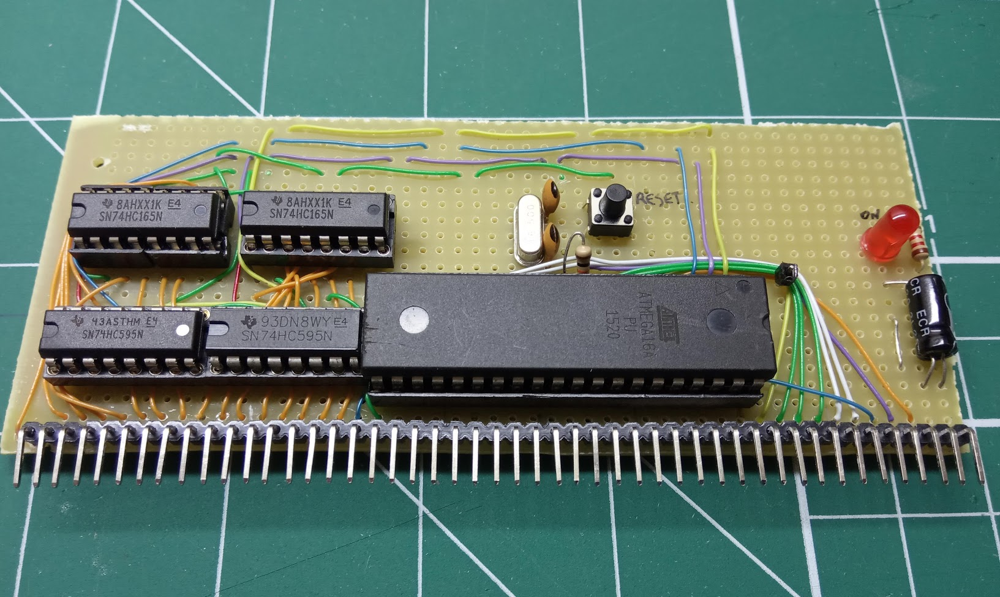
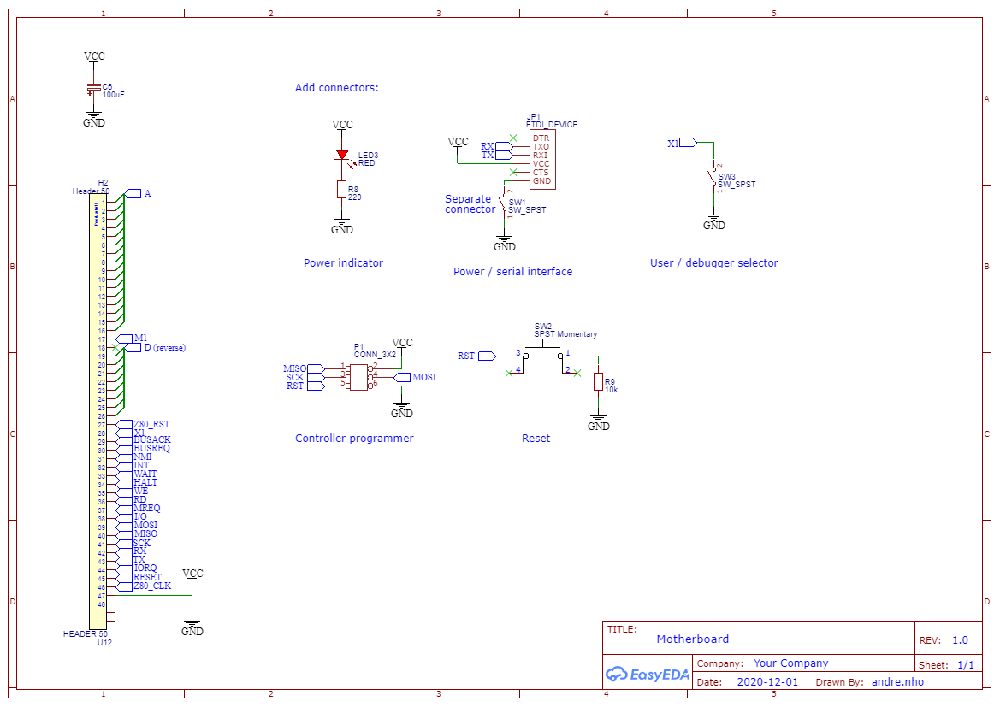
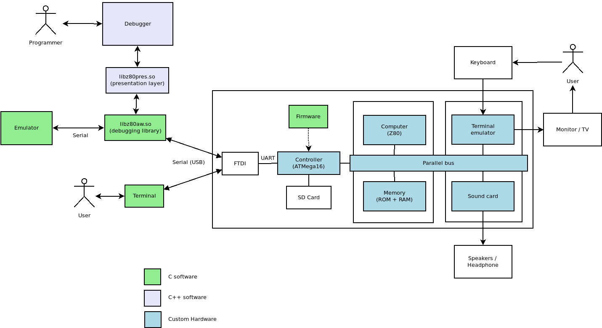

# z80_aw

This project is a homemade Z80 computer. It consist of 4 boards:

1. Computer
2. Controller / debugger
3. Motherboard
4. Peripherals (I/O)

## Computer

The computer is a Z80 processor linked to a 32k ROM memory IC, and a 32k RAM memory IC.



## Controller

The controller allows provides a serial interface that allows the circuit to be controlled by a modern computer. It also allows a modern computer to server as a terminal (video and keyboard).




Connecting to the debugger: FTDI driver must be installed

   $ ./terminal


## Motherboard

The motherboard simply connects rows of pins.

Pinout:

```
 1 - A0    (address bus)
 2 - A1
 3 - A2
 4 - A3
 5 - A4
 6 - A5
 7 - A6
 8 - A7
 9 - A8
10 - A9
11 - A10
12 - A11
13 - A12
14 - A13
15 - A14
16 - A15
17 - M1
18 - N.C.
19 - D0   (data bus)
20 - D1
21 - D2
22 - D3
23 - D4
24 - D5
25 - D6
26 - D7
27 - X0 (unused for now)
28 - X1 (unused for now)
29 - BUSACK
30 - BUSREQ
31 - NMI
32 - INT
33 - WAIT
34 - HALT
35 - WE
36 - RD
37 - MREQ
38 - I/O
39 - MOSI
40 - MISO
41 - SCK
42 - RX
43 - TX
44 - IORQ
45 - RESET
46 - Z80_CLK
47 - VCC
48 - GND
```



## Architecture


