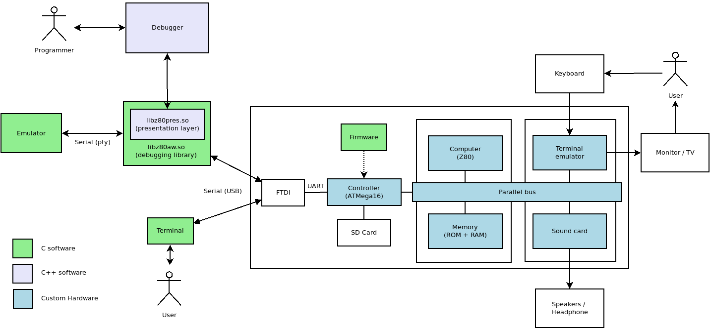

# z80_aw

This project is a homemade Z80 computer. It consist of 5 boards:

1. Computer
2. Controller / debugger
3. Motherboard
4. Storage controller
5. Video/audio card (not built yet)

# Computer

The computer is a Z80 processor linked to two 32k RAM memory ICs.


## Controller

The controller allows provides a serial interface that allows the circuit to be debugged by a modern computer. It also allows a modern computer to server as a terminal (video and keyboard).


Connecting to the debugger: FTDI driver must be installed

   $ ./terminal


## Motherboard

The motherboard simply connects rows of pins.


Pinout:

```
 1 - A0    (address bus)
 2 - A1
 3 - A2
 4 - A3
 5 - A4
 6 - A5
 7 - A6
 8 - A7
 9 - A8
10 - A9
11 - A10
12 - A11
13 - A12
14 - A13
15 - A14
16 - A15
17 - M1
18 - N.C.
19 - D0   (data bus)
20 - D1
21 - D2
22 - D3
23 - D4
24 - D5
25 - D6
26 - D7
27 - X0 (unused for now)
28 - SD_CS (activate SD card)
29 - BUSACK
30 - BUSREQ
31 - NMI
32 - INT
33 - WAIT
34 - HALT
35 - WE
36 - RD
37 - MREQ
38 - I/O
39 - MOSI
40 - MISO
41 - SCK
42 - RX
43 - TX
44 - IORQ
45 - RESET
46 - Z80_CLK
47 - VCC
48 - GND
```


## Storage controller


## Architecture



# Programming

- The CPU is a **Z80 processor** running at 6 Mhz.

- There **64 kB of RAM** that can be fully used.
  - There is no memory map. All communication with other devices happens through IN/OUT operations in Z80.

- **IN** operations:
  - **0x1**: returns last key pressed
  - **0x2**: returns last SD card stage (see `enum SDCardStage` in sdcard.h)
  - **0x3**: returns last SD card response (R1)


- **OUT** operations:
  - **0x0**: write character on screen
  - **0x1**: set register SDRD (low byte)
  - **0x2**: set register SDRD (high byte) and perform a 512 byte read on the SD card
  - **0x3**: set register SDWR (low byte)
  - **0x4**: set register SDWR (high byte) and perform a 512 byte write on the SD card

## SD Card operations

The registers **SDRD** and **SDWR** can be set by using IN/OUT operations in Z80. They are used to read from/write to
the SD Card, respectively.

They will point to a position in the RAM with the following structure:

| Byte | |
|------|-|
| `0..3` | Disk block where data will be read/written      |
| `4..5` | RAM address where the data will be written/read |
| `6..7` | Number of blocks to be read/written             |

IN operations **0x2** and **0x3** can be used to read the last card status and errors.
